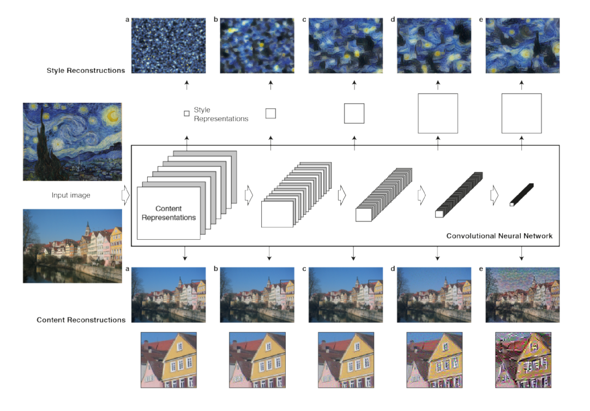

# Information
* Paper: [A Neural Algorithm of Artistic Style](https://arxiv.org/pdf/1508.06576v2.pdf)
* Author: Leon A. Gatys, Alexander S. Ecker, Matthias Bethge
* Implementation: [tensorflow](https://github.com/anishathalye/neural-style), [torch](https://github.com/jcjohnson/neural-style)

# Summary
* what:
  * The first paper to use convolutional neural networks to do style transfer given a content image and style image
  * They proposed a method to compute content loss and style loss and do style transfer by optimization
  * Basic ideas: the pre-trained VGG network has high-level features which represent the content of the image and has
  low-level features which represent the style of the image
* how:
  * First, feed the style image and content image into the pretrained VGG-16 network. Restore the activations of each layer
  * Then, generate a random white noise image based on Guassian distribution
  * Feed the white noise image into the VGG network. Calculate the content and style loss based on the previously extracted activations.
  Back-pro the loss and update the noisy image. Then feed the updated image into the VGG network. Repeat this for several iterations(eg: 1000)
  * How to calculate content loss:Average Euclidean distance between feature representations of content image and output image.
  * How to calculate style loss: Euclidean distance between Gram Matrix of style image and output image.
  * How to calculate Gram Matrix:  
    * The size of gram matrix is [C * C]. C is the channel number of j th layer.
    * Take the activations at j th layer and reshape it as one-dimension vector
    * Take pairs of activations from style image and output image, performs scalar product and sum it up as an element of gram matrix.
  * 
* results:
  * Different Styles
  
  * Different parameters
  
* important details:
  * They replaced max pooling with average pooling

# Page-by-Page walk-through
# Test Results of Chinese Painting Style
